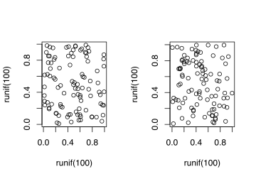
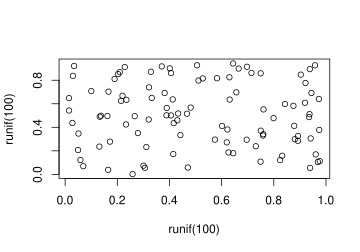

Sometimes you have to work with `base::plot` and to combine multiple plots the solution is e.g. `par(mfrow=c(1,2), ...)`.
Unfortunately using `par` can mess up all your future plots in the active R session.
This is one handy trick to get back to the default settings for plotting:


op = par(mfrow = c(1, 2))
plot(runif(100), runif(100))
plot(runif(100), runif(100))



par(op)
plot(runif(100), runif(100))


